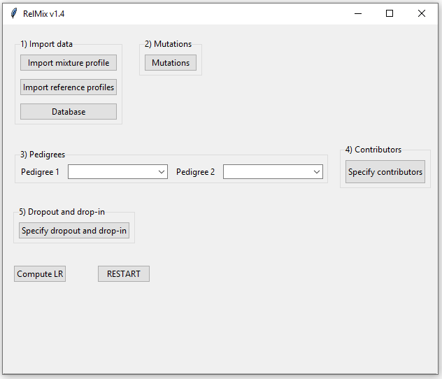
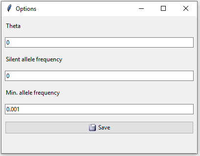
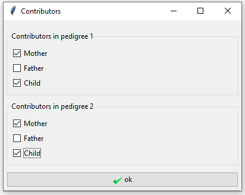
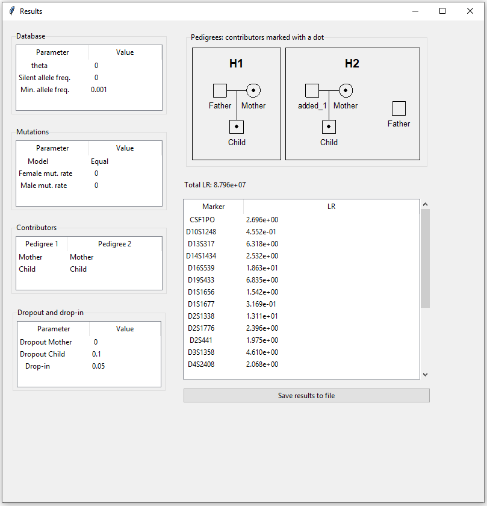
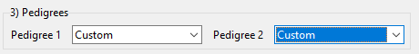
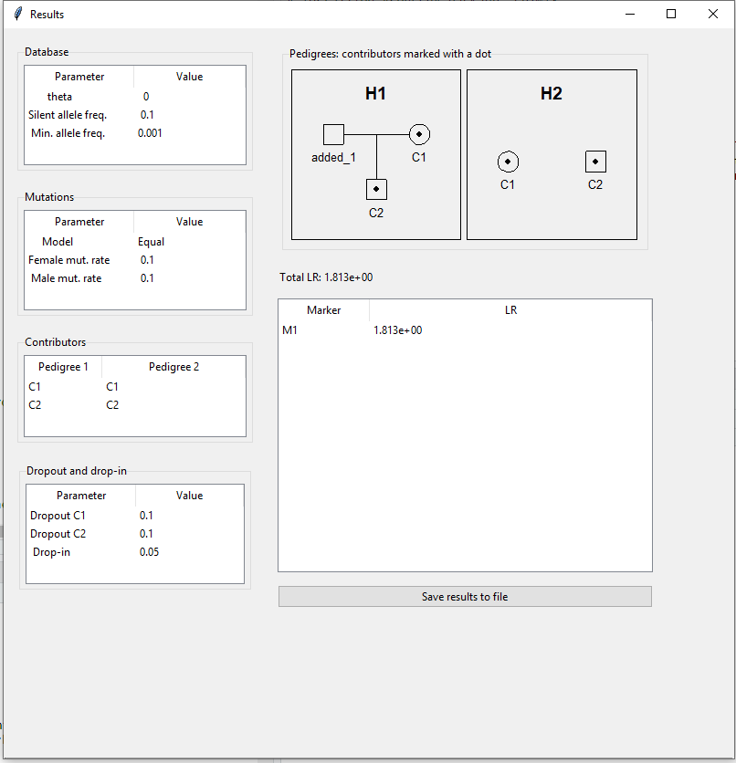

This vignette gives an introduction to RelMix 1.3, the graphical user interface of the relMix package described in Dørum et al. (2017). We will present the main features of the GUI with two examples.

##Getting started

Start RelMix by typing the following command in the R console
```{r, eval=FALSE} 
relMixGUI() 
```
which will open the user interface seen in Figure 1.

```{r, out.width =  400, fig.retina = NULL,echo=FALSE,fig.cap="Figure 1: The RelMix main window."}

```

##Example 1: A paternity case

In this example we consider a paternity case where we have a mixed DNA profile of a mother and child, in addition to reference profiles from the mother and the alleged father.

###1. Import data

The first step in RelMix is to import data. The import files must be either comma, semicolon or tab-separated and must have dots as decimal separators. Examples will be given for the three types of files that are needed: mixture profile, reference profiles and allele frequencies. The mixture profile and reference profiles should contain the same loci in the same order, while the allele frequency file can contain additional loci not in the profiles. RelMix will give an error message if the data file has an error that is fatal for the program. RelMix will return a warning if there is a minor error in the data file that is not fatal for the program.

####1a. Mixture profile

Table 1 shows the structure of the mixture file. The first line should contain column names as shown here:  'SampleName', 'Marker', 'Allele1' etc. The mixture profile in this example has a maximum of three unique alleles per markers, but the file may be expanded with columns 'Allele4', 'Allele5' and so on if there are additional observed alleles. In this example there are 22 markers, but only the first five are shown here. Only autosomal markers can be included. Marker names are case sensitive, and an error message will be given if markers are not found in the database.
```{r, echo=FALSE, results='asis'}
M <- read.table("mixture.txt",sep="\t",header=TRUE)
requireNamespace("pander",quietly=TRUE)
pander::pandoc.table(rbind(head(M, 5),data.frame(SampleName='...',Marker='...',Allele1='...',Allele2='...',Allele3='...')),missing="",caption="Table 1: The mixture profile in example 1.")
```

If there are multiple replicates, the next replicate profile must have a different sample name (e.g. "relMix2") and follow directly after the first replicate (i.e. no blank lines between).

####1b. Reference profiles

Table 2 shows the format of the file containing the reference profiles (all reference profiles have to be in the same file). The first line should correspond to the column names seen here. The different reference profiles follow directly after each other, and each profile should have a specific sample name. In our example there are two reference profiles, "Mother" and "Father". The file shoud only contain profiles of individuals defined in the pedigree. **Note:** as long as the built-in pedigrees are used, the reference profiles should be named either "Father", "Mother" or "Child" because these are the only individual IDs that are defined in these pedigrees. If custom pedigrees are provided, any sample name can be used (see example 2 below). Only the first two markers and the last one are shown for each profile.

```{r, echo=FALSE, results='asis'}
G <- read.table("references.txt",sep="\t",header=TRUE)
G2 <- rbind(G[1:2,],data.frame(SampleName='...',Marker='...',Allele1='...',Allele2='...'),G[22:24,],data.frame(SampleName='...',Marker='...',Allele1='...',Allele2='...'),G[44,])
rownames(G2) <- NULL
knitr::kable(G2,caption="Table 2: Reference profiles for mother and alleged father in example 1.")
```

####1c. Database

```{r, out.width = '30%', fig.align='center', echo=FALSE, fig.cap='Figure 2: Database window.'}
knitr::include_graphics("database_crop.png")
```
When clicking the database button in the main interface, the window in Figure 2 appears.
Table 3 shows the format of the allele frequencies to be imported here. There is one row per allele and one column per marker. A blank space indicates that the allele is not observed for that marker. Only an excerpt of the database is shown here.
```{r, echo=FALSE, results='asis'}
freqs <- read.table("frequencies22Markers.txt",sep="\t",header=T,stringsAsFactors=F)
freqs2 <- freqs[11:18,1:5]
rownames(freqs2) <- NULL
pander::pandoc.table(cbind(rbind(freqs2,rep('...',5)),'...'=rep('...',9)),missing="",digits=4,caption="Table 3: Excerpt of the allele frequency database in example 1. Dots are used as decimal separator.")
```

Clicking the 'Option' button opens up the window in Figure 3 with three additional settings: a theta value to correct for population substructure, a silent allele frequency and a minimum allele frequency. Any alleles with frequencies below the minimum allele frequency will by default be set to 0.001, this also applies to previously unobserved alleles. For this example we will keep the default values.
```{r, out.width =  350, fig.retina = NULL,echo=FALSE,fig.cap="Figure 3: Database options. Theta value, silent allele frequency and minimum allele frequency."}

```
When clicking 'Save' here we return to the window in Figure 2, where we need to click 'ok' to exit the database settings.
If a previously unobserved allele (i.e. not in the database) is found in the imported profiles, a notification will be given that the alllele has been added to the database with the minimum allele frequency. If the allele frequencies do not sum to 1, a question will appear of whether you would like to scale the frequencies. If not, a rest allele will be added.


###2. Mutations 
In this example we will not consider mutations, so we can ignore the 'Mutations' button.

###3. Pedigree
The pedigrees define the hypotheses.  There are three choices of pedigrees: 'Paternity', 'Unrelated' and 'Custom'. We choose 'Paternity' as the first pedigree and 'Unrelated' (alleged father and child are unrelated) as the second pedigree (Figure 4). In example 2 we show how to define a custom pedigree.
```{r, out.width =  300, fig.retina = NULL,echo=FALSE,fig.cap="Figure 4: Define the pedigrees in example 1."}
knitr::include_graphics("pedigrees_ex1.png")
```

###4. Contributors
Clicking the 'Specify contributors' button opens the window in Figure 5. We tick the individuals in the pedigree that are in the mixture, in this case the mother and child. It is possible to have different contributors for each pedigree, but here the contributors are the same under both hypotheses.
```{r, out.width =  150, fig.retina = NULL,echo=FALSE,fig.cap="Figure 5: Specify mother and child as the contributors in both pedigrees in example 1."}

```

###5. Dropout and drop-in
The last step is to specify dropout and drop-in values. See Dørum et al. (2017) for a detailed description about the drop-in/dropout model. By default all values are set to 0. In this case we expect no dropout from the mother so we set her dropout probability to 0, while the child is given a dropout probability of 0.1. The drop-in value is set to 0.05 (Figure 6).
```{r, out.width =  150, fig.retina = NULL,echo=FALSE,fig.cap="Figure 6: In example 1 we assume dropout probabilities 0 for the mother and 0.1 for the child and drop-in 0.05."}
knitr::include_graphics("dropout_ex1.png")
```

Note that if the dropout values are not set, an error window will occur. Even if you do not include dropout and drop-in, you must open the dropout window and click on the save button.

###6. Compute LR
Finally, we are ready to click the 'Compute LR' button. The result appears in a new pop-up window (Figure 7). The chosen parameters are displayed on the left, top right shows the pedigrees, followed by the total LR and a table displaying the LRs per marker. By clicking "Save results to file", the LRs together with the mixture profiles, reference profiles and the parameters will be saved to file.
```{r, out.width = 500, fig.retina = NULL,echo=FALSE,fig.cap="Figure 7: Results for example 1."}

```


##Example 2: Mutations, silent alleles and custom pedigree
Click the RESTART button before starting on a new case.

In this example we have a two-person mixture with one known contributor, and it is hypothesised whether the second contributor is the child of the first contributor, or someone unrelated. We take silent alleles and mutations into account. Only one locus is considered.

###1. Import data

####1a. Mixture profile

Table 4 shows the mixture file. There is only one observed allele for this locus.
```{r, echo=FALSE, results='asis'}
M <- read.table("mixture_silent_ex.txt",sep="\t",header=TRUE)
pander::pandoc.table(head(M, 5),missing="",caption="Table 4: Mixture file for example 2.")
```

####1b. Reference profiles
In this example there is only one known profile. Since we will provide a custom pedigree, the sample name of the profile can be anything as long as it corresponds to the ID in the pedigree.
```{r, echo=FALSE, results='asis'}
G <- read.table("references_silent.txt",sep="\t",header=TRUE)
rownames(G) <- NULL
knitr::kable(G,caption="Table 5: Reference profile for the known contributor (C1) in example 2.")
```

####1c. Database
The allele frequencies of the one diallelic marker are given in Table 6.
```{r, echo=FALSE, results='asis'}
freqs <- read.table("freqsSilent.txt",sep="\t",header=T,stringsAsFactors=F)
rownames(freqs) <- NULL
pander::pandoc.table(freqs,missing="",digits=4,caption="Table 6: Allele frequencies.")
```

In the database options we set the silent allele frequency equal to 0.1 (Figure 8).
```{r, out.width =  350, fig.retina = NULL,echo=FALSE,fig.cap="Figure 8: Database options for example 2."}

```
When clicking the "Save" button we are asked if we want to scale or add a rest allele since the frequencies no longer sum to 1 now that a silent allele frequency has been added. We click yes to scale.
```{r, out.width =  350, fig.retina = NULL,echo=FALSE,fig.cap="Figure 9: Scale frequencies or add rest allele."}
knitr::include_graphics("scaling_ex2.png")
```
**Note 1**: A rest allele can only be addded if the sum of frequencies is less than 1. Therefore, enforced scaling will be performed if we click "No" and the sum is larger than 1.

**Note 2**: The added rest allele is given the name "r". If a stepwise mutation model is chosen (see section below), numeric allele names are required, so in this case scaling must be chosen.

###2. Mutations
Clicking the mutation button in the main interface opens a new window. By default mutations are not accounted for (mutation rate set to 0). There are three mutation models to choose from. The 'Equal' mutation model assumes that all mutations are equally likely, the 'Proportional' model assumes mutation rates to be proportional to allele frequencies, and the 'Stepwise' mutation model assumes that mutations to closer allelles (fewer sequence repeats difference) are more probable. When 'Stepwise' is chosen, a range must also be specified that indicates the relative probability of mutating n+1 steps versus mutating n steps. This mutation model requires that the allele names are numerics indicating the number of sequence repeats. It does not account for microinvariants, and will treat mutations to and from microinvariants as practically impossible. This option corresponds to the model 'Stepwise (unstationary)' in Familias 3. Mutations to and from silent alleles are not possible for any of the models. See the Familias manual for more details on the mutation models (http://familias.no).

In this example we will use an equal mutation model with mutation rate 0.1 for both males and females.
```{r, out.width =  200, fig.retina = NULL,echo=FALSE,fig.cap="Figure 10: Mutations in example 2."}

```

###3. Pedigree
Since the hypotheses in this example are not covered by the built-in pedigrees, we will provide RelMix with custom pedigrees defined in R scripts. The R scripts can for instance be exported from Familias 3, but can also be generated manually. The script below shows the code needed to provide the first pedigree where the two contributors are mother and child. 

```{r, eval=FALSE}
persons <- c("C2","C1")
ped1 <- FamiliasPedigree(id=persons, dadid=c(NA,NA), momid=c("C1", NA), 
                         sex=c("male", "female"))
```

The second pedigree, where the two contributors are unrelated, is defined as below.
```{r, eval=FALSE}
persons <- c("C2","C1")
ped1 <- FamiliasPedigree(id=c(persons), dadid=c(NA, NA), 
                         momid=c( NA, NA), sex=c("male", "female"))
```
**Note 1**: Each pedigree must be defined in a variable called "ped1".

**Note 2**: The names of the individuals in a pedigree (the id) must correspond to the names of individuals in the reference profiles.

**Note 3**: Each pedigree must be defined in a separate R script.

Figure 11 shows how to import the custom pedigrees from R scripts, one script per pedigree.
```{r, out.width =  300, fig.retina = NULL,echo=FALSE,fig.cap="Figure 11: We import custom pedigrees from R scripts in example 2."}

```

###4. Contributors
Both individuals defined in the pedigrees are contributors under both hypotheses. It is only their relationship that changes between the two pedigrees.
```{r, out.width =  150, fig.retina = NULL,echo=FALSE,fig.cap="Figure 12: Tick both individuals as contributors to the mixture in both pedigrees."}
knitr::include_graphics("contributors_ex2.png")
```

###5. Dropout and drop-in
In this example we believe there may be dropout in both contributors' profiles. We set their dropout probabilities to 0.1 and the drop-in value to 0.05.

```{r, out.width =  150, fig.retina = NULL,echo=FALSE,fig.cap="Figure 13: Possible dropout for both contributors in example 2."}
knitr::include_graphics("dropout_ex2.png")
```

###6. Compute LR
The resulting LR for example 2 is shown in Figure 14. Note that in pedigree 2 there are are no relations to plot.
```{r, out.width =  500, fig.retina = NULL,echo=FALSE,fig.cap="Figure 14: Computed LR for example 2."}

```

### References
Dørum, G., Kaur, N., & Gysi, M. (2017). Pedigree-based relationship inference from complex DNA mixtures. International journal of legal medicine, 131(3), 629-641.
